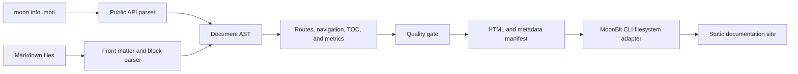
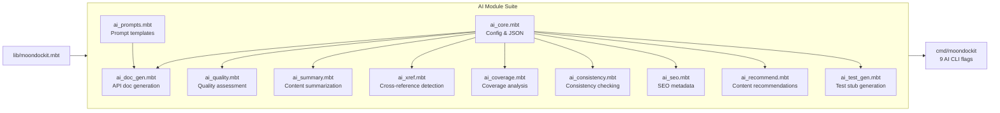

# Architecture and Design Decisions

## Build Pipeline

The reusable package owns parsing, validation, rendering, search data,
interactive search delivery, sitemap generation, metrics, and quality
evaluation. Filesystem access is isolated in the CLI package, so the core
library remains deterministic and backend-neutral.

## Key Decisions

### MoonBit-first core

All domain behavior is implemented in MoonBit and exposed through the package
API. The Node.js adapter only reads source files and writes the generated
manifest. It does not parse Markdown or generate HTML.

### Manifest before filesystem

The renderer returns `Array[OutputFile]` instead of writing files directly.
This makes output deterministic, keeps tests fast, and lets other MoonBit tools
embed MoonDocKit without using the bundled CLI.

### Scoped Markdown support

MoonDocKit implements the subset needed by package documentation and treats
site generation as its primary value. Unsupported syntax remains plain text
instead of producing unsafe or unpredictable HTML.

The security model is documented separately in `docs/security-model.md`,
including escaping rules, safe link handling, search UI construction, and the
CLI filesystem boundary.

### Publish-time quality gate

Validation, content metrics, and manifest checks are combined into an
explainable score. Every check has a name, result, and message so a failed build
can be diagnosed rather than merely rejected.

## AI-assisted Development

AI tools assisted with implementation drafts, test-case generation,
documentation editing, and repository checks. Project scope, architecture,
public API boundaries, acceptance criteria, licensing, and final review remain
under participant control. Generated changes are accepted only after formatting,
MoonBit checks, tests, and reproducible example builds pass.

## AI Module Architecture

The `ai/` package provides 11 modules for AI-driven documentation analysis:

### AI Module Responsibilities

| Module | Responsibility |
|--------|---------------|
| `ai_core.mbt` | AI configuration, chat messages, JSON request builder, JSON field parser |
| `ai_prompts.mbt` | Prompt template system with `{{variable}}` substitution |
| `ai_doc_gen.mbt` | API documentation generation with complexity and usage analysis |
| `ai_quality.mbt` | Quality scoring (completeness, readability, examples, structure) + site aggregation |
| `ai_summary.mbt` | Page summaries, keyword extraction, content type detection, audience estimation |
| `ai_xref.mbt` | Cross-reference detection, orphan page identification, hub page ranking |
| `ai_coverage.mbt` | API symbol coverage analysis with per-kind breakdown and recommendations |
| `ai_consistency.mbt` | Heading style, hierarchy, code labels, duplicate content, length outlier detection |
| `ai_seo.mbt` | Meta descriptions, keyword density, search boost scoring, OG types |
| `ai_recommend.mbt` | Learning paths, next-step suggestions, related pages, hub identification |
| `ai_test_gen.mbt` | Test stub generation from API symbols |

### AI Design Principles

1. **Mock-first**: All AI modules use rule-based mock implementations, no
   external API calls required. The `AiConfig` struct supports real LLM
   integration but defaults to mock mode for reproducibility.

2. **Composable**: Each AI module operates independently. CLI flags can be
   combined in any order. The combined `--ai-*` build generates all outputs
   in a single pass.

3. **Markdown-native**: AI output files use front matter and Markdown for
   seamless integration with the existing MoonDocKit rendering pipeline.

4. **Test-driven**: 84 AI-specific tests cover all public functions, edge
   cases (empty sites, single pages, duplicate content), and output
   formatting.

## Verification Boundary

The current acceptance path verifies:

- default and JavaScript MoonBit targets;
- 118 tests (34 core + 84 AI), all passing;
- ten compiled CLI integration scenarios;
- a runnable in-memory demo;
- a real Markdown-directory CLI build;
- full AI suite build (9 AI flags, 11 output files);
- required output files and project documents;
- a measured coverage baseline.
