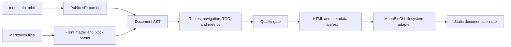

# Architecture and Design Decisions

## Build Pipeline

The reusable package owns parsing, validation, rendering, search data,
interactive search delivery, sitemap generation, metrics, and quality
evaluation. Filesystem access is isolated in the CLI package, so the core
library remains deterministic and backend-neutral.

## Key Decisions

### MoonBit-first core

All domain behavior is implemented in MoonBit and exposed through the package
API. The Node.js adapter only reads source files and writes the generated
manifest. It does not parse Markdown or generate HTML.

### Manifest before filesystem

The renderer returns `Array[OutputFile]` instead of writing files directly.
This makes output deterministic, keeps tests fast, and lets other MoonBit tools
embed MoonDocKit without using the bundled CLI.

### Scoped Markdown support

MoonDocKit implements the subset needed by package documentation and treats
site generation as its primary value. Unsupported syntax remains plain text
instead of producing unsafe or unpredictable HTML.

The security model is documented separately in `docs/security-model.md`,
including escaping rules, safe link handling, search UI construction, and the
CLI filesystem boundary.

### Publish-time quality gate

Validation, content metrics, and manifest checks are combined into an
explainable score. Every check has a name, result, and message so a failed build
can be diagnosed rather than merely rejected.

## AI-assisted Development

AI tools assisted with implementation drafts, test-case generation,
documentation editing, and repository checks. Project scope, architecture,
public API boundaries, acceptance criteria, licensing, and final review remain
under participant control. Generated changes are accepted only after formatting,
MoonBit checks, tests, and reproducible example builds pass.

## Verification Boundary

The current acceptance path verifies:

- default and JavaScript MoonBit targets;
- 50 blackbox tests;
- ten compiled CLI integration scenarios;
- a runnable in-memory demo;
- a real Markdown-directory CLI build;
- required output files and project documents;
- a measured coverage baseline.
